# Picotop Architecture

A comprehensive architectural overview of Picotop - the sophisticated Bitcoin cycle prediction platform built as part of the Odyssey ecosystem.

## 🏗️ System Overview

Picotop is architected as a modern, real-time analytics platform using Next.js 15 with a focus on accurate market prediction, beautiful user interfaces, and seamless data integration across multiple sources.


## 🎯 Odyssey Ecosystem Integration

### Platform Philosophy
Picotop embodies the Odyssey vision of democratizing advanced crypto analytics while maintaining enterprise-grade reliability and user experience.

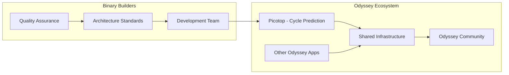

## 📊 Advanced Prediction Architecture

### Cycle Prediction Engine

```mermaid
graph TB
    subgraph "Historical Data Analysis"
        COVID[COVID Crash (Mar 2020)]
        Bull2020[2020-2021 Bull Run]
        Bear2022[2022 Bear Market]
        Recovery2023[2023 Recovery]
        Current2024[2024-2025 Cycle]
    end
    
    subgraph "Prediction Models"
        PiCycle[Pi Cycle Top Model]
        Rainbow[Rainbow Chart Analysis]
        NUPL[NUPL Cycle Analysis]
        AppCorrelation[App Ranking Correlation]
    end
    
    subgraph "Output Predictions"
        CycleTop[Sept 2025 Cycle Top]
        PriceTarget[$150K-$185K Target]
        AltSeason[Oct 2025 ALT Peak]
        Distribution[Distribution Strategy]
    end
    
    COVID --> PiCycle
    Bull2020 --> Rainbow
    Bear2022 --> NUPL
    Recovery2023 --> AppCorrelation
    Current2024 --> PiCycle
    
    PiCycle --> CycleTop
    Rainbow --> PriceTarget
    NUPL --> AltSeason
    AppCorrelation --> Distribution
```

### Real-time Market Analysis

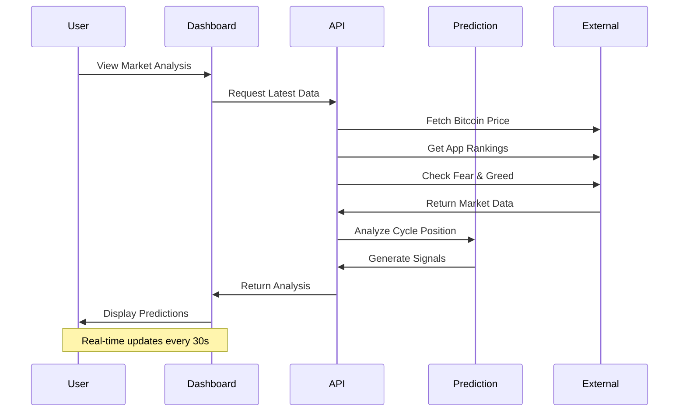

## 🎨 Component Architecture

### Chart System Architecture

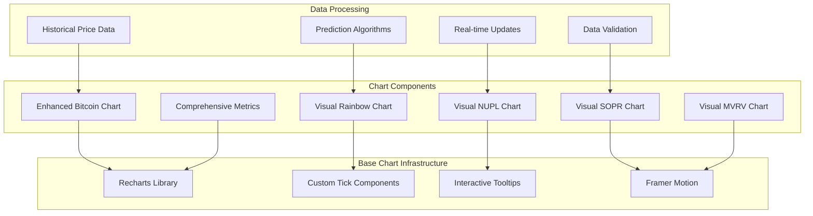

### Theme System Architecture

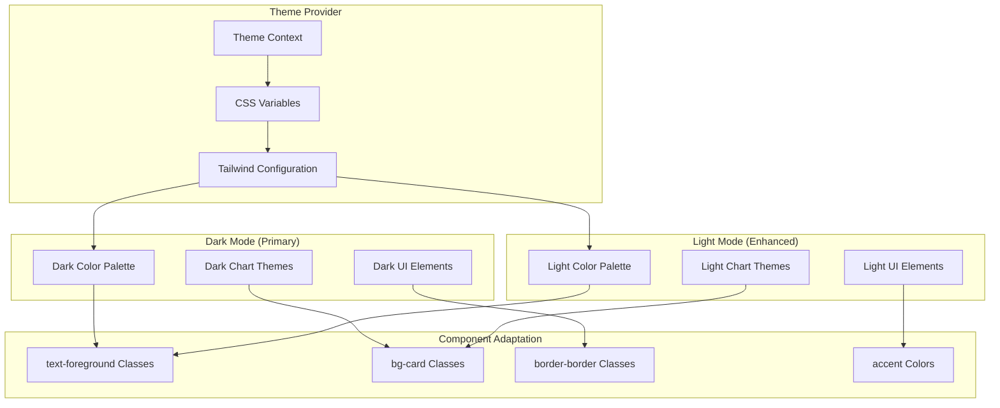

## 📱 App Store Integration Architecture

### Ranking Analysis System

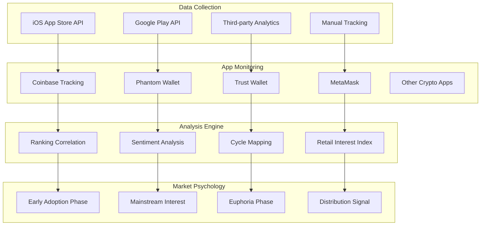

## 🔮 Advanced Analytics Pipeline

### Multi-Metric Convergence Analysis

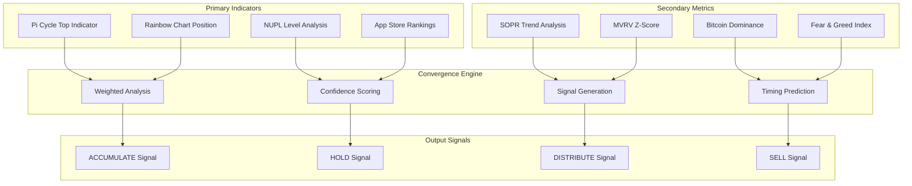

### Historical Pattern Recognition

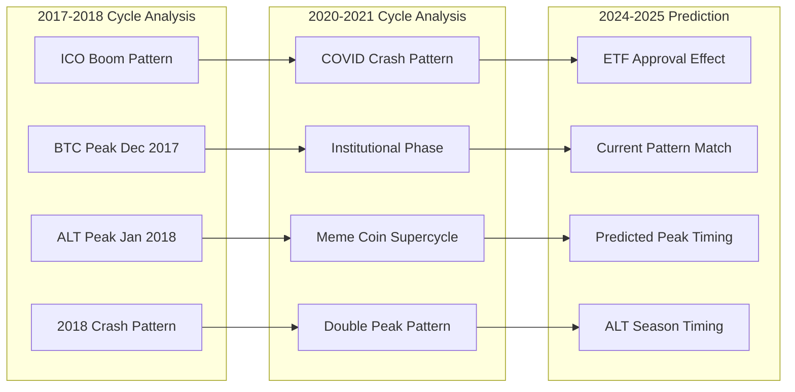

## 🚀 Deployment & Infrastructure

### Vercel Deployment Architecture

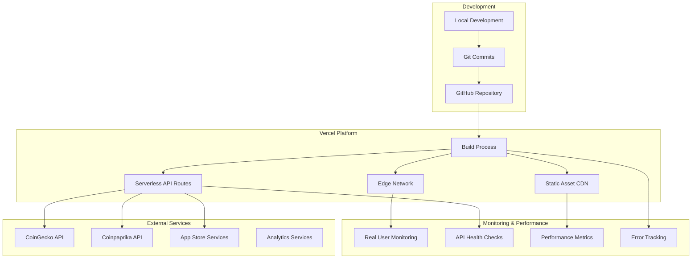

### Performance Optimization Strategy

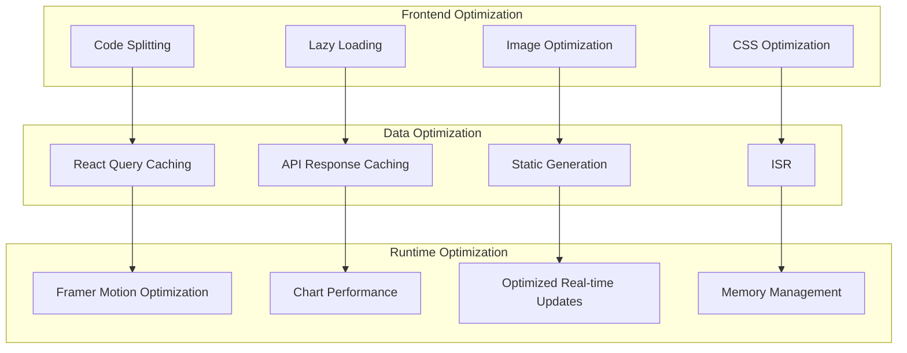

## 🎨 User Experience Architecture

### Animation System

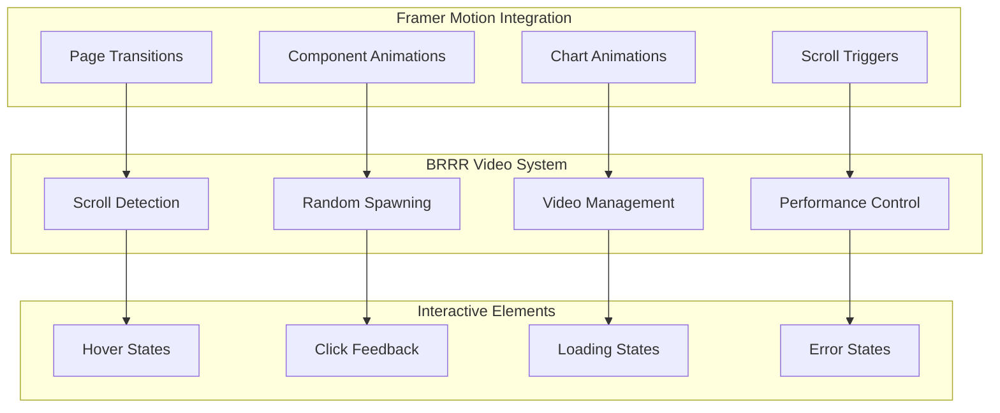

### Responsive Design Strategy

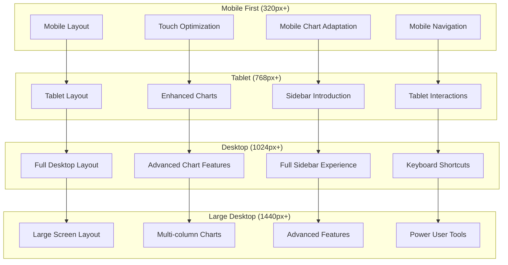

## 🔐 Security & Reliability

### Data Security Architecture

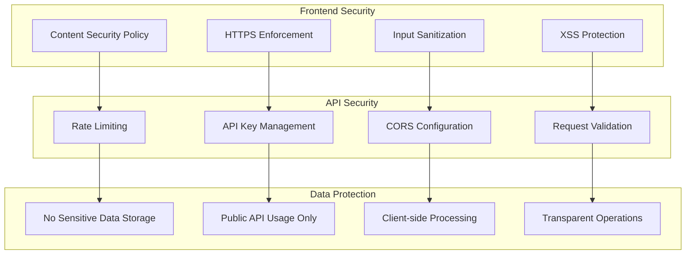

This architecture ensures Picotop delivers enterprise-grade reliability while maintaining the innovative, user-friendly experience that defines the Odyssey ecosystem. The platform is designed to scale with user growth while continuously improving prediction accuracy through advanced analytics and machine learning integration.