# CycleTop Architecture

This document provides a comprehensive overview of the CycleTop application architecture, including system design, data flow, and component structure.

## 🏗️ System Overview

CycleTop is built as a modern, scalable web application using Next.js with a focus on real-time data processing and beautiful user interfaces.

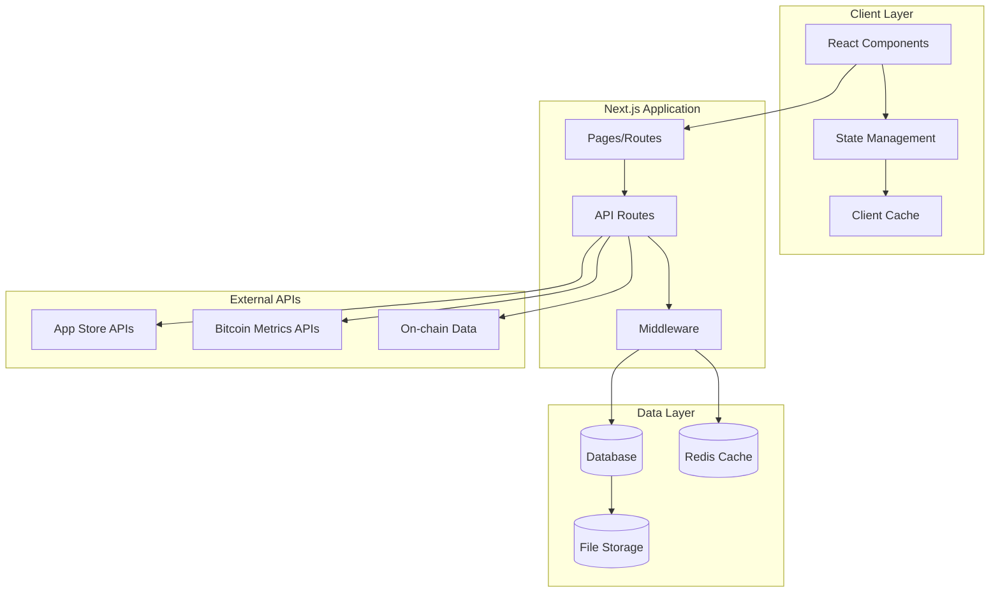

## 🎯 Application Architecture

### Frontend Architecture

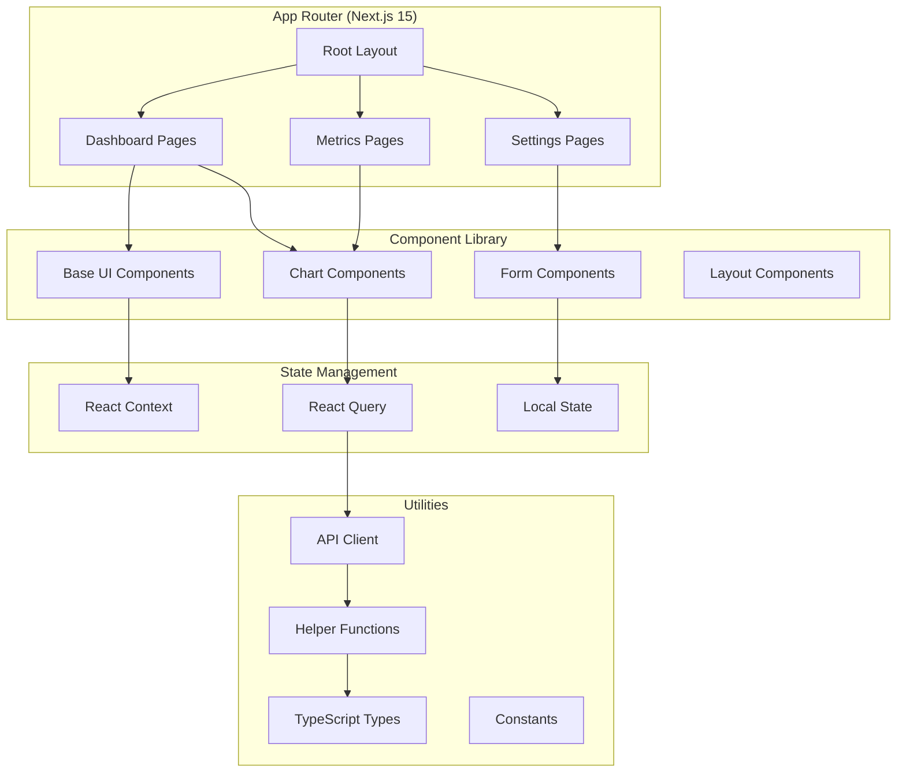

### Data Flow Architecture

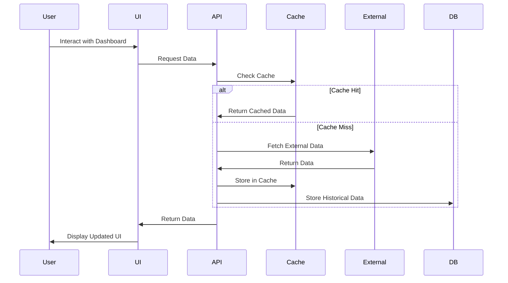

## 📊 Data Sources Integration

### App Store Rankings

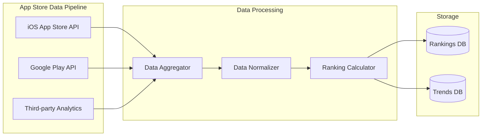

### Bitcoin Metrics Pipeline

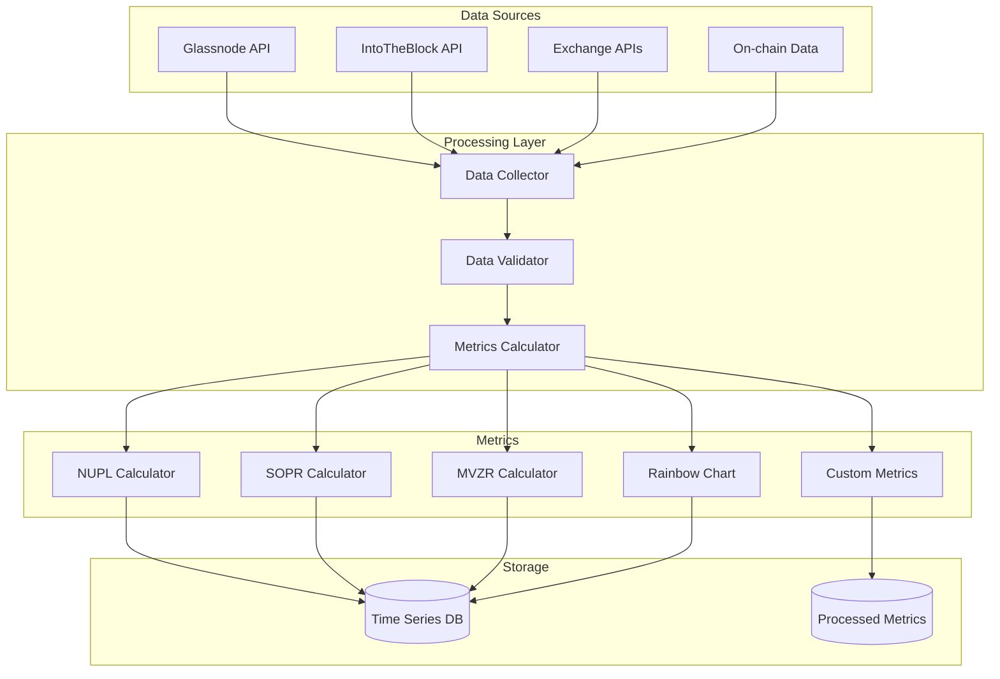

## 🎨 Component Architecture

### UI Component Hierarchy

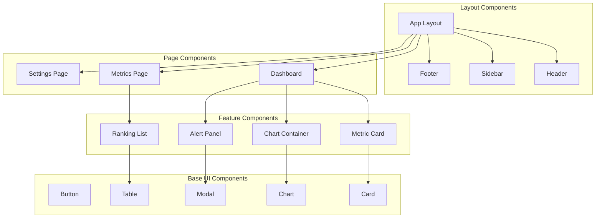

### State Management Flow

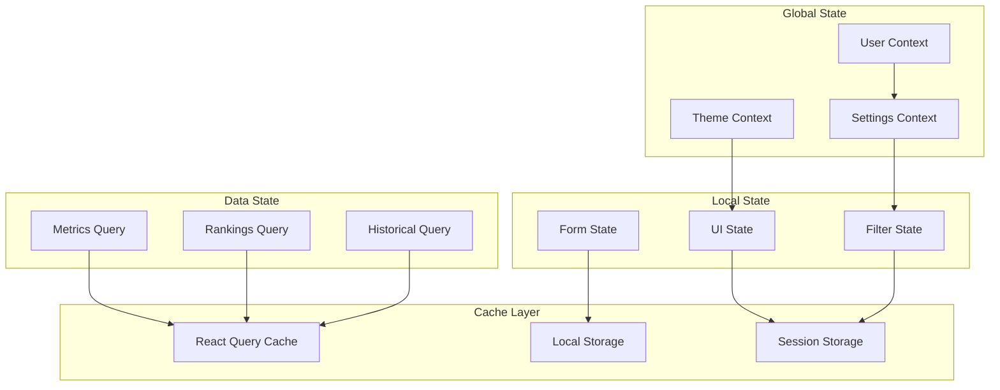

## 🔄 Data Processing Pipeline

### Real-time Data Flow

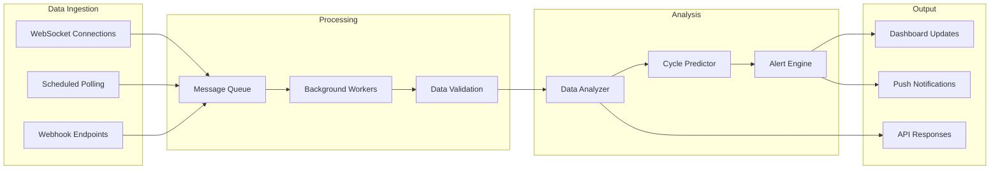

### Cycle Prediction Algorithm

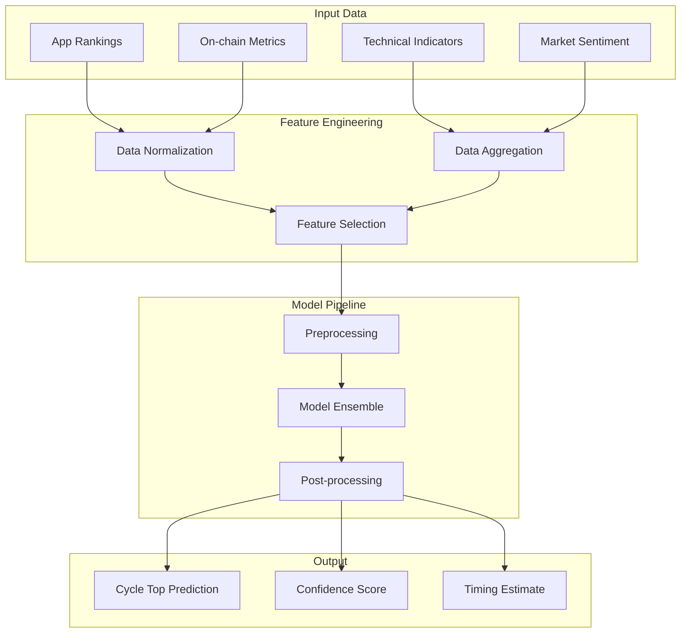

## 🚀 Deployment Architecture

### Production Environment

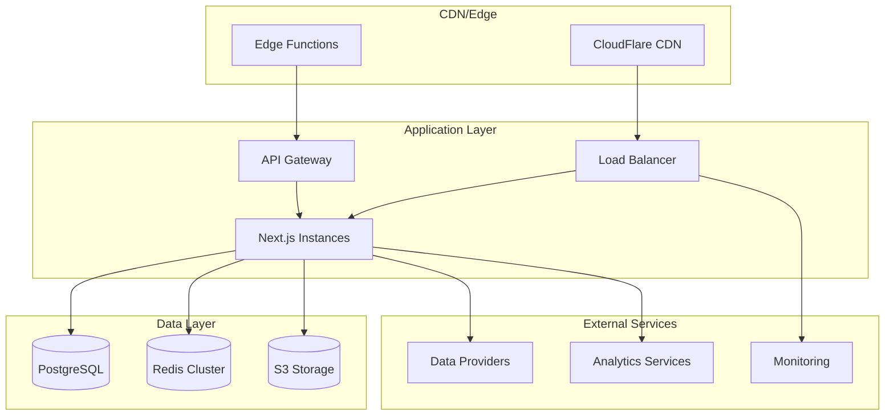

## 🔧 Development Workflow

### Build and Deployment Pipeline

```mermaid
graph LR
    subgraph "Development"
        Local[Local Development]
        Testing[Unit Testing]
        Linting[Code Linting]
    end
    
    subgraph "CI/CD"
        GitHooks[Git Hooks]
        Actions[GitHub Actions]
        Building[Build Process]
    end
    
    subgraph "Staging"
        Preview[Preview Deployment]
        E2E[E2E Testing]
        Performance[Performance Testing]
    end
    
    subgraph "Production"
        Deploy[Production Deploy]
        Monitor[Monitoring]
        Rollback[Rollback Capability]
    end
    
    Local --> Testing
    Testing --> Linting
    Linting --> GitHooks
    
    GitHooks --> Actions
    Actions --> Building
    Building --> Preview
    
    Preview --> E2E
    E2E --> Performance
    Performance --> Deploy
    
    Deploy --> Monitor
    Monitor --> Rollback
```

## 📱 Responsive Design Architecture

### Breakpoint Strategy

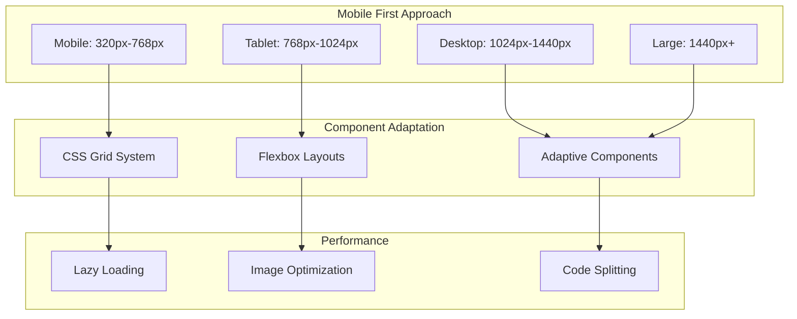

## 🔐 Security Architecture

### Security Layers

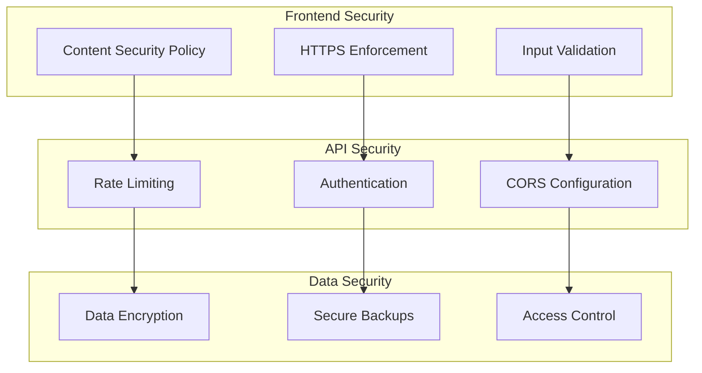

This architecture ensures a scalable, maintainable, and performant application that can handle real-time data processing while providing an exceptional user experience.