# Picojeet Architecture

A comprehensive architectural overview of Picojeet - the sophisticated Bitcoin cycle prediction platform delivering actionable trading signals through advanced on-chain analytics.

## 🏗️ System Overview

Picojeet is architected as a modern, real-time analytics platform using Next.js 15 with a focus on accurate cycle prediction, beautiful visualizations, and seamless multi-source data integration.


## 🎯 Core Features & Architecture

### Bitcoin Cycle Prediction Engine


### Real-time Chart System


## 🎨 Component Architecture

### Enhanced Chart System


### Dashboard Layout System


## 📊 Cycle Prediction Algorithm

### Mathematical Model

```mermaid
graph TB
    subgraph "Input Variables"
        CurrentPrice[Current Price: $105,722]
        HistoricalData[Historical Monthly Highs]
        CyclePosition[Current Cycle Position]
        VolatilityFactors[Volatility Factors]
    end
    
    subgraph "Calculation Engine"
        BaseTarget[Base Target = Current × 1.25]
        CycleAdjustment[Cycle Position Adjustment]
        VolatilitySmoothing[Volatility Smoothing]
        PatternMatching[Pattern Matching]
    end
    
    subgraph "Output Prediction"
        PredictedPeak[Predicted Peak: $132K]
        PeakTiming[Peak Timing: 6 months]
        ConfidenceLevel[Confidence Level: High]
        ActionSignal[Action Signal: ACCUMULATE]
    end
    
    CurrentPrice --> BaseTarget
    HistoricalData --> CycleAdjustment
    CyclePosition --> VolatilitySmoothing
    VolatilityFactors --> PatternMatching
    
    BaseTarget --> PredictedPeak
    CycleAdjustment --> PeakTiming
    VolatilitySmoothing --> ConfidenceLevel
    PatternMatching --> ActionSignal
```



### Prediction Formula

The core prediction algorithm uses the following formula:

```
Predicted Peak = Current Price × Growth Factor × Cycle Multiplier × Volatility Dampener

Where:
- Growth Factor = 1.25 (base 25% growth expectation)
- Cycle Multiplier = f(months_to_peak, historical_patterns)
- Volatility Dampener = sin(cycle_position) × volatility_constant
- Peak Timing = 6 months from current (based on cycle analysis)
```

## 📱 App Store Integration Architecture

### Retail Interest Tracking


## 🎨 Theme System Architecture

### Dual Theme Implementation


## 🚀 Performance Optimization

### Frontend Optimization Strategy


## 🔐 Security & Reliability

### Security Implementation


## 🎯 Technical Specifications

### Technology Stack

- **Framework**: Next.js 15 with App Router
- **Language**: TypeScript 5.0+
- **Styling**: Tailwind CSS 3.4+ with CSS Variables
- **Charts**: Recharts 2.8+ with custom components
- **Animations**: Framer Motion 11+
- **State Management**: React Query (TanStack Query)
- **Theme System**: next-themes with system detection
- **Deployment**: Vercel with Edge Functions
- **Package Manager**: Yarn 1.22+

### API Integration

- **Bitcoin Data**: BGeo Metrics API (primary), CoinGecko API, Coinpaprika API
- **On-chain Metrics**: BGeo Metrics for NUPL, SOPR, MVRV, and Bitcoin dominance
- **App Store Data**: App Store Connect API, Google Play Console API
- **Market Sentiment**: Fear & Greed Index API
- **Real-time Updates**: 30-second polling intervals
- **Caching Strategy**: React Query with 5-minute cache TTL
- **Error Handling**: Graceful fallbacks and retry logic

This architecture ensures Picojeet delivers enterprise-grade reliability while maintaining an innovative, user-friendly experience. The platform is designed to scale with user growth while continuously improving prediction accuracy through advanced analytics and real-time data integration.